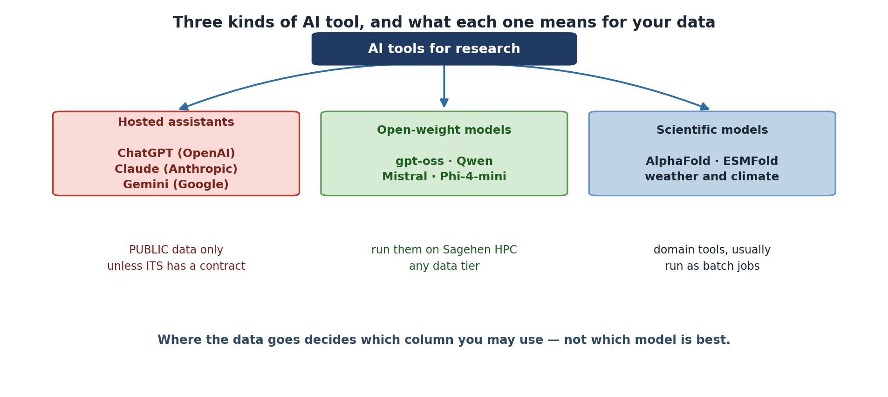

:::::::::::::::::::::::::::::::::::::: questions

- What AI tools are available for research and academia?
- Why would you run AI models on HPC clusters instead of cloud services?

::::::::::::::::::::::::::::::::::::::::::::::

::::::::::::::::::::::::::::::::::::: objectives

- Survey the landscape of modern AI tools and models
- Understand why HPC matters for AI-assisted research
- Recognize when cloud vs. local AI is appropriate

::::::::::::::::::::::::::::::::::::::::::::::

## Why HPC for AI Tools?

Many researchers ask: "Why use Sagehen HPC for AI when services like ChatGPT
are so easy to use?"

{alt='Three groups of AI tool. Hosted assistants, including ChatGPT from OpenAI, Claude from Anthropic and Gemini from Google, are for PUBLIC data only unless ITS holds a contract covering them. Open-weight models such as gpt-oss, Qwen, Mistral and Phi-4-mini can be run on Sagehen HPC with any data tier. Scientific models such as AlphaFold, ESMFold and weather and climate models are domain tools usually run as batch jobs. A note says that where the data goes decides which column you may use, not which model is best.'}

::::::::::::::::::::::::::::::::::::: callout
## Data Privacy is Non-Negotiable for Restricted Data

Cloud AI services cannot be used with restricted data (FERPA, medical records,
export-controlled research). If your data is protected by law, it must stay on
Pomona infrastructure. This decision is about **compliance**, not preference.

::::::::::::::::::::::::::::::::::::::::::::::

### Reasons to Use HPC for AI

- **Data privacy**: Restricted data (FERPA, medical, financial) cannot go to
  external services
- **Computational power**: Sagehen HPC's 10 GPUs — A100 (80 GB), L40S (48 GB),
  and RTX PRO 6000 (96 GB ECC) — handle production workloads
- **Data locality**: Working with large datasets is faster on local storage
  than uploading to cloud services
- **Reproducibility**: Full control over model versions and environments
- **Cost**: Sagehen HPC is included in lab allocations; cloud GPU costs scale
  rapidly with intensive compute

## The Modern AI Landscape

### Large Language Models (LLMs)

**Cloud-based (proprietary):** ChatGPT (OpenAI), Claude (Anthropic),
Gemini (Google). Per-token pricing; best for quick queries with non-sensitive
data.

**Local (open-weight, can run on Sagehen):** gpt-oss (OpenAI), Qwen (Alibaba),
Mistral, Phi (Microsoft), Gemma (Google), Llama (Meta). Useful sizes run from
about 4B to over 100B parameters. Best for sensitive data, fine-tuning, and
cost-effective batch work.

::::::::::::::::::::::::::::::::::::: callout

## "Open-Weight" Is Not the Same as "Open-Source"

You can download and run these models, but the licences differ sharply. Some
are Apache 2.0 or MIT; others carry custom terms with use restrictions, and
some require you to request access before downloading. Training data is almost
never released, so none are open-source in the sense a software licence means it.

Check the licence before you build a published result on a model — see
Episode 10.

::::::::::::::::::::::::::::::::::::::::::::::

### Computer Vision and Scientific ML

**Vision models** for Sagehen: YOLO (object detection), Stable Diffusion
(image generation), CLIP (image-text understanding), SAM (segmentation).

**Scientific ML**: AlphaFold (protein structure), ESMFold, weather prediction
models, climate downscaling, satellite imagery analysis.

### Model Size and Requirements

Rather than memorise a model list that will be out of date within months, learn
the arithmetic:

```
VRAM for weights ≈ parameters × bytes-per-parameter
  16-bit → 2 bytes | 8-bit → 1 byte | 4-bit → 0.5 bytes
Then add 20-40% for activations and the KV cache; much more for long contexts.
```

So a 7B model needs roughly 14 GB at 16-bit, or 3.5 GB at 4-bit, plus headroom.

Worked examples, **accurate as of August 2026** — check current sizes on
Hugging Face before planning a job:

| Model | Precision | Weights | Sensible GPU |
|-------|-----------|---------|--------------|
| Phi-4-mini (3.8B) | 4-bit | ~2 GB | Any |
| Qwen3 8B | 4-bit | ~4 GB | L40S |
| gpt-oss-20b | native | ~16 GB | L40S |
| Qwen3 32B | 4-bit | ~16 GB | L40S |
| gpt-oss-120b | native | ~60 GB | A100 |
| Llama 4 Scout (109B total) | 4-bit | ~55 GB | A100 |
| Stable Diffusion XL | 16-bit | ~7 GB | L40S |

::::::::::::::::::::::::::::::::::::: callout

## Mixture-of-Experts Models Still Need All the Weights

Several current models are **mixture-of-experts**: Llama 4 Scout has 109B total
parameters but activates only about 17B per token. That makes it *faster* than
its size suggests, not *smaller*. All 109B must be resident in GPU memory.

Size your GPU request from **total** parameters. Sizing from the active count
is a common and expensive mistake.

::::::::::::::::::::::::::::::::::::::::::::::

::::::::::::::::::::::::::::::::::::: callout

## The AI Tool Decision is Data-Driven

It is tempting to choose AI tools based on capability, but the actual decision
rule is simpler: **what data are you using?** Once you know the data
classification, the tool choice is largely determined.

::::::::::::::::::::::::::::::::::::::::::::::

::::::::::::::::::::::::::::::::::::: challenge

## Challenge: Match Models to GPUs

For each model below, identify which Sagehen GPU (L40S 48 GB, A100 80 GB,
or RTX PRO 6000 96 GB) is the minimum required:

1. Phi-4-mini 3.8B at 4-bit (~5GB VRAM)
2. Qwen3 32B at 4-bit (~20GB VRAM)
3. gpt-oss-120b (~60GB VRAM)
4. Stable Diffusion XL (24GB VRAM)
5. gpt-oss-120b serving a 128K-token context (~90GB VRAM)

::::::::::::::::::::::::::::::::::::: solution

## Solution

1. **Phi-4-mini**: L40S (48GB) -- 5GB used, enormous headroom
2. **Qwen3 32B 4-bit**: L40S (48GB) -- 20GB used, room for long contexts
3. **gpt-oss-120b**: A100 (80GB) -- needs 60GB, exceeds L40S
4. **Stable Diffusion XL**: L40S (48GB) -- 24GB fits, with room for batching
5. **gpt-oss-120b, 128K context**: RTX PRO 6000 (96GB) -- the KV cache pushes
   total memory past the A100's 80GB

The L40S is the least contended card, so small and mid-sized jobs should
start there. Scale up only when the memory figure genuinely requires it.

Notice that items 3 and 5 are the *same model*: context length alone moved the
job up a GPU tier. Estimate your context budget before you request a card.

::::::::::::::::::::::::::::::::::::::::::::::

::::::::::::::::::::::::::::::::::::::::::::::

::::::::::::::::::::::::::::::::::::: keypoints

- HPC is essential for sensitive data, large models, and reproducible research
- Cloud AI is easy but sends data externally; local AI keeps data private
- Model size, memory requirements, and accuracy vary widely across AI tools
- Data classification -- not model capability -- should drive tool selection

::::::::::::::::::::::::::::::::::::::::::::::
