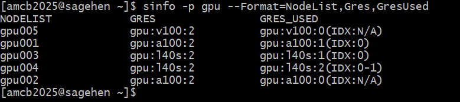

:::::::::::::::::::::::::::::::::::::: questions

- How do I set up AI tools on Sagehen HPC?
- What modules and environments are needed?
- How do I access GPUs and submit AI jobs?

::::::::::::::::::::::::::::::::::::::::::::::

::::::::::::::::::::::::::::::::::::: objectives

- Load required modules for AI work (anaconda3, CUDA)
- Create conda environments for PyTorch and TensorFlow
- Access GPU resources via Slurm for interactive and batch jobs
- Configure model caching to avoid quota issues

::::::::::::::::::::::::::::::::::::::::::::::

## Sagehen HPC Storage for AI Work

| Location | Quota | Use For |
|----------|-------|---------|
| `/rhome/<myusername>` | 100GB | Code, conda environments, notebooks |
| `/bigdata/lab/<labname>` | 1TB shared (BeeGFS) | Large datasets, model checkpoints |
| `/scratch` | Temporary (deleted when the job ends) | Job I/O, intermediate results |

Download large models to `/bigdata` or `/scratch` -- not your home directory.

## Loading Modules

```bash
module purge
module load anaconda3          # Python and package management
module load cuda/12.2.1        # NVIDIA CUDA toolkit (current default)
module list                    # Verify loaded modules
```

There is no separate cuDNN module on Sagehen -- the GPU-enabled PyTorch and
TensorFlow packages you install with conda bundle their own cuDNN libraries.

## Creating a Conda Environment

```bash
module load anaconda3
conda create -n ai-pytorch python=3.11
conda activate ai-pytorch

# Install PyTorch with GPU support
conda install pytorch::pytorch torchvision torchaudio pytorch-cuda=12.1 \
    -c pytorch -c nvidia

# Install common packages
conda install numpy pandas scikit-learn matplotlib jupyter -c conda-forge
```

For TensorFlow, create a separate environment:

```bash
conda create -n ai-tensorflow python=3.11
conda activate ai-tensorflow
pip install tensorflow[and-cuda]
```

## Configure Model Caching

By default, Hugging Face downloads to `~/.cache/huggingface`, which fills your
home quota quickly. Redirect it:

```bash
mkdir -p /bigdata/lab/<labname>/huggingface_cache
export HF_HOME=/bigdata/lab/<labname>/huggingface_cache
# Add to your .bashrc or Slurm scripts to make permanent
```

## Interactive GPU Sessions

Before requesting a GPU, check the `gpu` partition's current state with `sinfo -p gpu`:

{alt='Terminal output of sinfo -p gpu on Sagehen HPC listing the gpu partition with a 30-day time limit and its GPU nodes, showing their current allocation state.'}

```bash
srun --partition=gpu --gres=gpu:1 --mem=64G \
     --cpus-per-task=8 --time=04:00:00 --pty bash

module purge && module load anaconda3 cuda/12.2.1
conda activate ai-pytorch
python -c "import torch; print(torch.cuda.is_available())"
```

## Batch Jobs for Model Training

```bash
#!/bin/bash
#SBATCH --job-name=llama-inference
#SBATCH --partition=gpu
#SBATCH --gres=gpu:1
#SBATCH --mem=80G
#SBATCH --cpus-per-task=16
#SBATCH --time=08:00:00
#SBATCH --output=logs/%j.log

module purge && module load anaconda3 cuda/12.2.1
source activate ai-pytorch
export HF_HOME=/bigdata/lab/<labname>/huggingface_cache

python your_script.py
```

Submit with `sbatch your_script.sh`.

::::::::::::::::::::::::::::::::::::: callout

## Start Small and Scale Up

When first testing an AI workflow, request a smaller GPU (L40S) with less time.
Once your script works reliably, scale to larger GPUs or longer time limits.
This saves compute hours and reduces queue wait time.

You can see which GPU types exist and how heavily they're used with `sinfo`'s GRES columns:

{alt='Terminal output of sinfo -p gpu with the NodeList, Gres and GresUsed columns on Sagehen. Each GPU node is listed with the generic resources it advertises and, alongside, how many of those GPUs are currently allocated versus idle, so you can see at a glance which GPU type is least contended.'}

::::::::::::::::::::::::::::::::::::::::::::::

## Common Troubleshooting

- **"No module named torch"**: Load anaconda3 and activate your conda environment
- **"CUDA out of memory"**: Use 4-bit quantization, reduce batch size, or
  request a larger GPU
- **Home quota full from models**: Set `HF_HOME` to `/bigdata`
- **GPU not detected**: Verify the cuda module is loaded and your job requested a GPU (`--gres=gpu:1`)

::::::::::::::::::::::::::::::::::::: challenge

## Challenge: Write a GPU Setup Script

Write a Slurm script that loads modules, activates a conda environment, sets
HF_HOME, and verifies GPU access by printing `torch.cuda.is_available()` and
the GPU name.

::::::::::::::::::::::::::::::::::::: solution

## Solution

```bash
#!/bin/bash
#SBATCH --job-name=gpu-test
#SBATCH --partition=gpu
#SBATCH --gres=gpu:1
#SBATCH --mem=32G
#SBATCH --cpus-per-task=4
#SBATCH --time=00:10:00

module purge && module load anaconda3 cuda/12.2.1
conda activate ai-pytorch
export HF_HOME=/bigdata/lab/<labname>/huggingface_cache

python3 -c "
import torch
print(f'GPU available: {torch.cuda.is_available()}')
if torch.cuda.is_available():
    print(f'GPU: {torch.cuda.get_device_name(0)}')
    print(f'Memory: {torch.cuda.get_device_properties(0).total_mem / 1e9:.0f} GB')
"
```

Submit with `sbatch gpu_test.sh` and check output in `slurm-*.out`.

::::::::::::::::::::::::::::::::::::::::::::::

::::::::::::::::::::::::::::::::::::::::::::::

::::::::::::::::::::::::::::::::::::: keypoints

- Load the anaconda3 and cuda modules before GPU work
- Use conda environments for reproducible, isolated Python setups
- Configure HF_HOME to /bigdata to avoid filling home quota with models
- Use `srun` for interactive GPU testing and `sbatch` for batch jobs
- Start with smaller GPUs and scale up once your workflow is validated

::::::::::::::::::::::::::::::::::::::::::::::

<!-- highlight <labname>/<myusername> placeholders in code blocks; remove if the varnish theme handles this natively -->
<script>(function(){var CSS='.sh-placeholder{color:#c2410c;font-weight:700}[data-bs-theme="dark"] .sh-placeholder,html.dark .sh-placeholder{color:#fdba74}@media (prefers-color-scheme: dark){[data-bs-theme="auto"] .sh-placeholder{color:#fdba74}}';var RX=/<labname>|<myusername>/g;function firstMatch(el){var w=document.createTreeWalker(el,NodeFilter.SHOW_TEXT,null),nodes=[],full='';while(w.nextNode()){nodes.push({n:w.currentNode,s:full.length});full+=w.currentNode.nodeValue;}RX.lastIndex=0;var m;while((m=RX.exec(full))){var s=m.index,e=s+m[0].length,inSpan=false,parts=[];for(var j=0;j<nodes.length;j++){var ns=nodes[j].s,ne=ns+nodes[j].n.nodeValue.length;if(ne<=s||ns>=e)continue;parts.push({node:nodes[j].n,a:Math.max(s-ns,0),b:Math.min(e-ns,nodes[j].n.nodeValue.length)});var p=nodes[j].n.parentNode;while(p&&p!==el){if(p.classList&&p.classList.contains('sh-placeholder')){inSpan=true;break;}p=p.parentNode;}}if(!inSpan&&parts.length)return parts;}return null;}function wrapParts(parts){for(var i=parts.length-1;i>=0;i--){var t=parts[i].node,txt=t.nodeValue,a=parts[i].a,b=parts[i].b;var span=document.createElement('span');span.className='sh-placeholder';span.textContent=txt.slice(a,b);var f=document.createDocumentFragment();if(a>0)f.appendChild(document.createTextNode(txt.slice(0,a)));f.appendChild(span);if(b<txt.length)f.appendChild(document.createTextNode(txt.slice(b)));t.parentNode.replaceChild(f,t);}}function run(){var st=document.createElement('style');st.textContent=CSS;document.head.appendChild(st);document.querySelectorAll('pre,code').forEach(function(el){var guard=0,parts;while((parts=firstMatch(el))&&guard++<500){wrapParts(parts);}});}if(document.readyState==='loading'){document.addEventListener('DOMContentLoaded',run);}else{run();}})();</script>
